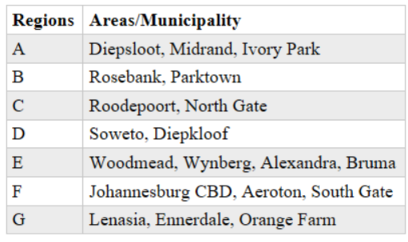
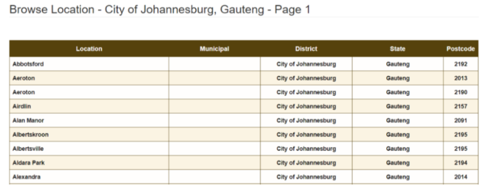

# Week 4
## Introduction/Business Problem
### Introduction
#### a. City Background
The city of Johannesburg is located in Gauteng province (one of 9 provinces in the country). It is often referred to as Jozi, Joburg or Egoli and it’s the largest city in South Africa. As of 2021, the population of Joburg is estimated to be 5.7 million with 76.4% are Black African, 12.3% are White people, 5.6% are coloured people, and 4.9% are Indian/Asian.
Johannesburg has the the largest man-made forest in the world, it is also one of the largest 50 urban agglomerations in the world and the largest city in the world that is not located on near a water body.
The city is divided into 7 distinct regions or municipalities:
Regions or municipalities can be viewed as boroughs
Each municipality is constructed from locations or suburbs
Location or suburbs can be viewed as neighbourhoods

#### b. Problem Description
Joburg is very diverse in its population distribution and there is a fair mix of ethnic groups within each location/suburb. We will use clustering and segmentation methods to investigate and find a good location for establishing an Asian restaurant within the Midrand municipality.
Special emphasis will be on an area where the restaurant will be first of its kind or increase on a currently small footprint.

## Data Description
### Data Description
This means identifying what type of patterns will be needed to address the question most effectively. If the question is to determine probabilities of an action, then a predictive model might be used. If the question is to show relationships, a descriptive approach maybe be required.
This project will look into the municipality/Region data and the locations/suburbs within each municipality in Joburg.
For each location in Joburg, we will look at the venues (i.e. restaurants) that exist within that location.

#### a. Locations within Joburg:
This data is retrieved from Johannesburg postal code data (on: https://www.southafricapostcode.com/location/gauteng/city-of-johannesburg/):
    - This data will be scrapped over 57 pages of data within above url
    - This data does not contain the Region/Municipality data, this data will be retrieved from other sources

#### b. Region/Municipality data in Joburg:
Municipality data is retrieved from (https://www.joburg.org.za/about_/regions/Pages/City-of-Johannesburg-regions.aspx):
Data is arranged in 7 different Regions (A to G)
Data is scrapped from each Region, however the format within each page is not common and some pages present data in html while others in pdf
Will be explained further in Section 3

#### c. Venues data within each location in Joburg:
This data will be retrieved from Foursquare by using predefined credentials for the Foursquare API

# Week 5: Capstone Project
## Final Report: 
https://kidreck.medium.com/best-location-to-start-an-asian-restaurant-in-jozi-a-data-science-perspective-d7e332aba7c5
